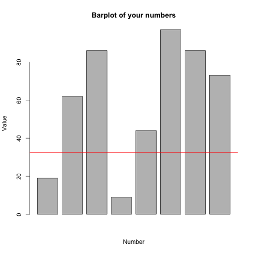

My Shiny app
========================================================
author: Marco Bonifazi
date: 19th February 2015

What does my app do?
========================================================

My Shiny apps provides the possibility to insert some numbers and choose a calculation to be done on them.

There is also the possibility of showing a simple barplot of the values of the numbers inserted.

Several calculations are possible:
- Mean
- Variance
- Standard deviation
- Max
- Min

Calculation of some statistics
========================================================
Once you have inserted a set of numbers, the app does its calculation.
Here we show a simple calculation of a standard deviation.
The numbers in this slide are randomly generated instead of inserting them in the GUI.

```r
n <- 8
vect <- c()

for (i in 1:n) {
  vect[i] <- sample(100, 1, replace=TRUE)
}
value <- sd(vect)
value
```

```
[1] 32.57957
```

Generation of a simple barplot
========================================================
The app can generate barplot in order to give an indication of the values of the number inserted.

Here is an example of a plot, the red line shows the standard deviation
 

Description of the app
========================================================
I have created this app to test the following:
- Usage of numericInput widgets with an attempt to create them in a dynamic and flexible way
- Usage of reactive function to encapsulate some operations (switch, creation of the numeric vector)
- Creation of some GUI elements in the server.R function to make the creation dynamic
- Usage of tabs and conditional tabs to make the documentation and the sidebar work nicely
